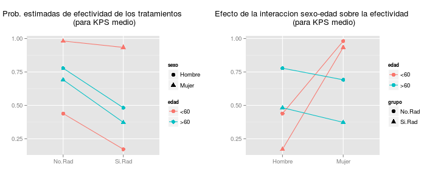
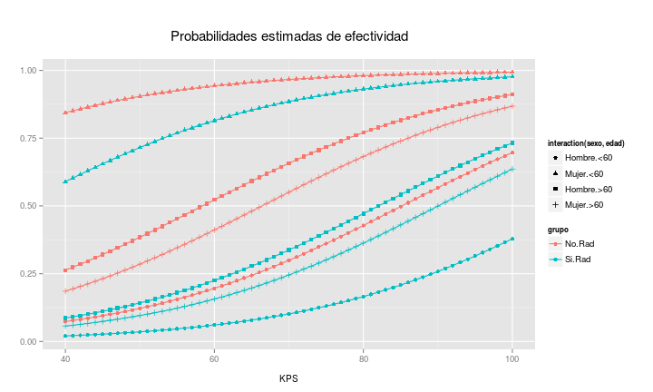

Se trata de analizar los datos de dos ensayos sencillos en los que se comparan dos
grupos, en el primer caso mediante una respuesta continua y en el segundo mediante una
respuesta dicotómica.

En ambos casos hay que comparar las respuestas de los dos grupos primero sin ajustes
de ningún tipo y luego ajustando por las covariables que se consideren oportunas. También
hay que seleccionar un tamaño muestral para un ensayo posterior algo mayor y redactar un
pequeño informe con las conclusiones (que contenga un anexo con el script de R que se haya
utilizado).

# **PRIMER ENSAYO**

Son datos de un ensayo clínico con pacientes con adenomas en colon y recto. (Giardielo
et al., 1993, Treatment of colonic and rectal adenomas with Sulindac in familial adenomatous
polyposis. New England Journal of Medicine, 328, 1313-1316).

Los datos muestran el número de pólipos, en logaritmos decimales, al principio del
ensayo y al año de tratamiento:


|grupo   |   antes| despues|
|:-------|-------:|-------:|
|tratado | 0.84510| 0.60206|
|control | 0.69897| 1.41497|
|tratado | 1.36173| 1.20412|
|control | 1.54407| 1.60206|
|tratado | 1.04139| 1.14613|
|control | 1.07918| 1.20412|
|control | 0.84510| 1.04139|
|control | 2.50243| 2.63749|
|tratado | 2.20412| 1.41497|
|tratado | 0.90309| 0.84510|
|control | 1.30103| 1.65321|
|control | 1.04139| 1.50515|
|control | 1.38021| 1.90309|
|tratado | 1.53148| 1.53148|
|control | 1.73239| 1.57978|
|control | 1.47712| 1.75587|
|tratado | 1.00000| 0.84510|
|tratado | 1.30103| 0.00000|
|tratado | 1.07918| 0.90309|

Sumario de los datos:

$\\$


|grupo        |variable     |value           |
|:------------|:------------|:---------------|
|control:20   |antes  :19   |Min.   :0.000   |
|tratado:18   |despues:19   |1st Qu.:1.010   |
|             |             |Median :1.301   |
|             |             |Mean   :1.307   |
|             |             |3rd Qu.:1.541   |
|             |             |Max.   :2.637   |


|grupo   |  Min.| 1st Qu.| Median|  Mean| 3rd Qu.|  Max.|
|:-------|-----:|-------:|------:|-----:|-------:|-----:|
|antes   | 0.699|   1.021|  1.301| 1.309|   1.504| 2.502|
|despues | 0.000|   0.972|  1.415| 1.305|   1.591| 2.637|


|grupo   |  Min.| 1st Qu.| Median|  Mean| 3rd Qu.|  Max.|
|:-------|-----:|-------:|------:|-----:|-------:|-----:|
|control | 0.699|   1.173|  1.491| 1.495|   1.673| 2.637|
|tratado | 0.000|   0.860|  1.060| 1.098|   1.347| 2.204|


|grupo   |variable |  n|  Min.| 1st Qu.| Median|  Mean| 3rd Qu.|  Max.|
|:-------|:--------|--:|-----:|-------:|------:|-----:|-------:|-----:|
|control |antes    | 10| 0.699|   1.051|  1.341| 1.360|   1.527| 2.502|
|control |despues  | 10| 1.041|   1.438|  1.591| 1.630|   1.730| 2.637|
|tratado |antes    |  9| 0.845|   1.000|  1.079| 1.252|   1.362| 2.204|
|tratado |despues  |  9| 0.000|   0.845|  0.903| 0.944|   1.204| 1.531|

\pagebreak

**Objetivos del análisis estadístico:**

## 1. Análisis estadístico de los datos. ¿Tiene algún efecto el tratamiento en los resultados?

### a) Primera aproximación: análisis de única variable respuesta `despues`

+ **Análisis descriptivo**


|grupo   |  n|  Min.| 1st Qu.| Median|  Mean| 3rd Qu.|  Max.|     S|    SE|
|:-------|--:|-----:|-------:|------:|-----:|-------:|-----:|-----:|-----:|
|control | 10| 1.041|   1.438|  1.591| 1.630|   1.730| 2.637| 0.434| 0.137|
|tratado |  9| 0.000|   0.845|  0.903| 0.944|   1.204| 1.531| 0.462| 0.154|

donde desviación típica $S=\frac{x-\bar{x}}{n-1}$ y error estándar de la media $SE_{\bar{x}}=\frac{s}{\sqrt{n}}$

$\\$

 

$\\$

El número de pólipos al año de tratamiento parece ser mayor en el grupo control que en el grupo tratado.

\pagebreak

+ **Análisis estadístico: ¿es la media en el número de pólipos al año de tratamiento significativamente diferente entre los grupos `control` y `tratado`?**
$$H_0:\mu_c=\mu_t \ ; \ H_1:\mu_c\neq\mu_t$$

**ANOVA:** F-test $$F=\frac{MS_B}{MSE}$$


```
##             Df Sum Sq Mean Sq F value Pr(>F)   
## grupo        1  2.230  2.2301   11.14 0.0039 **
## Residuals   17  3.404  0.2002                  
## ---
## Signif. codes:  0 '***' 0.001 '**' 0.01 '*' 0.05 '.' 0.1 ' ' 1
```

donde:

+ `Sum Sq` es la suma de cuadrados entre grupos $SSB$ (`grupo`)  
y la suma de cuadrados dentro de los grupos $SSE$ (`residuals`)
+ `Mean Sq` es la variabilidad entre grupos $MS_B$ (`grupo`)  
y la variabilidad dentro de los grupos $MSE$ (`residuals`)
+ `F value` es el $\text{F-ratio}$ (`grupo`)
+ `Pr(>F)` es el p-value (`grupo`)

$\text{F-ratio}>1$ es significativo $\rightarrow MS_B>MSE \rightarrow$ se rechaza $H_0$
$\\$

**Comparación de medias:** t-test $$t=\frac{\bar{x_t}-\bar{x_c}}{SE_\text{diff}}$$

donde $SE_\text{diff}=\sqrt{\frac{S^2_c}{n_c}+\frac{S^2_t}{n_t}}=\frac{S_c}{\sqrt{n_c}}+\frac{S_t}{\sqrt{n_t}}$ 
$\\$


```
             Estimate Std. Error t value Pr(>|t|)    
(Intercept)    1.6297     0.1415  11.518 1.88e-09 ***
grupotratado  -0.6862     0.2056  -3.337   0.0039 ** 
---
Signif. codes:  0 ‘***’ 0.001 ‘**’ 0.01 ‘*’ 0.05 ‘.’ 0.1 ‘ ’ 1
```


donde:

+ `Estimate` es la estimación de la media $\bar{x_c}$ (`Intercept`)  
y la estimación de la diferencia entre las medias $\bar{x_t}-\bar{x_c}$ (`grupotratado`)
+ `Std.Error` es el error estándar de la media $SE_{\bar{x_c}}$ (`Intercept`)  
y el error estándar de la diferencia entre las medias $SE_\text{diff}$ (`grupotratado`)
+ `|t-value|`$=t$ (`grupotratado`) 
+ `Pr(>|t|)` es el p-value (`grupotratado`)

$Pr(>|t|)$ es significativo $\rightarrow \bar{x_c}-\bar{x_t}\neq0 \rightarrow$ se rechaza $H_0$

\pagebreak

### b) Segunda aproximación: análisis de variable `efecto <- antes-despues`


|grupo   |   antes| despues|   efecto|
|:-------|-------:|-------:|--------:|
|tratado | 0.84510| 0.60206|  0.24304|
|control | 0.69897| 1.41497| -0.71600|
|tratado | 1.36173| 1.20412|  0.15761|
|control | 1.54407| 1.60206| -0.05799|
|tratado | 1.04139| 1.14613| -0.10474|
|control | 1.07918| 1.20412| -0.12494|
|control | 0.84510| 1.04139| -0.19629|
|control | 2.50243| 2.63749| -0.13506|
|tratado | 2.20412| 1.41497|  0.78915|
|tratado | 0.90309| 0.84510|  0.05799|
|control | 1.30103| 1.65321| -0.35218|
|control | 1.04139| 1.50515| -0.46376|
|control | 1.38021| 1.90309| -0.52288|
|tratado | 1.53148| 1.53148|  0.00000|
|control | 1.73239| 1.57978|  0.15261|
|control | 1.47712| 1.75587| -0.27875|
|tratado | 1.00000| 0.84510|  0.15490|
|tratado | 1.30103| 0.00000|  1.30103|
|tratado | 1.07918| 0.90309|  0.17609|

+ **Análisis descriptivo**


|grupo   |  n|   Min.| 1st Qu.| Median|   Mean| 3rd Qu.|  Max.|     S|   SE|
|:-------|--:|------:|-------:|------:|------:|-------:|-----:|-----:|----:|
|control | 10| -0.716|  -0.436| -0.238| -0.270|  -0.128| 0.153| 0.253| 0.08|
|tratado |  9| -0.105|   0.058|  0.158|  0.308|   0.243| 1.301| 0.449| 0.15|

 

Para mismos valores de `antes`, el grupo control tiene valores mayores de `despues` $\rightarrow$ parece haber diferencias en el efecto entre los dos grupos de tratamiento.

+ **Análisis estadístico: ¿es la media del `efecto` significativamente diferente entre los grupos `control` y `tratado`?**
$$H_0:\mu_c=\mu_t \ ; \ H_1:\mu_c\neq\mu_t$$

**ANOVA:** F-test $$F=\frac{MS_B}{MSE}$$


```
##             Df Sum Sq Mean Sq F value  Pr(>F)   
## grupo        1  1.582  1.5818   12.29 0.00271 **
## Residuals   17  2.188  0.1287                   
## ---
## Signif. codes:  0 '***' 0.001 '**' 0.01 '*' 0.05 '.' 0.1 ' ' 1
```

$\text{F-ratio}>1$ es significativo $\rightarrow MS_B>MSE \rightarrow$ se rechaza $H_0$
$\\$

**Comparación de medias:** t-test $$t=\frac{\bar{x_t}-\bar{x_c}}{SE_\text{diff}}$$


```
             Estimate Std. Error t value Pr(>|t|)   
(Intercept)   -0.2695     0.1135  -2.375  0.02955 * 
grupotratado   0.5779     0.1649   3.505  0.00271 **
---
Signif. codes:  0 ‘***’ 0.001 ‘**’ 0.01 ‘*’ 0.05 ‘.’ 0.1 ‘ ’ 1
```

$Pr(>|t|)$ es significativo $\rightarrow \bar{x_c}-\bar{x_t}\neq0 \rightarrow$ se rechaza $H_0$

\pagebreak

### c) Tercera aproximación: ANCOVA (covariable `antes`)

+ **Análisis descriptivo**  
$$\text{despues}_c=\alpha_c+\beta_c * \text{antes}_c$$
$$\text{despues}_t=\alpha_t+\beta_t * \text{antes}_t$$


 

El intercept $\alpha$ es diferente para cada grupo $\rightarrow$ el grupo de tratamiento parece tener efecto sobre la variable respuesta `despues`, donde el grupo control presentaría mayor número de pólipos al año de tratamiento que el grupo tratado.

La pendiente $\beta$ es similar entre ambos grupos $\rightarrow$ el efecto de la covariable `antes` sobre la variable respuesta `despues` parece ser similar para ambos grupos, y no parece haber interacción entre la covariable y el grupo.

+ **Análisis estadístico**

**Ajuste de modelo completo con interacción:**
$$\text{despues}=\alpha_{grupo}+\beta * \text{antes}+\alpha_{grupo}\beta * \text{antes}$$


```
                   Estimate Std. Error t value Pr(>|t|)   
(Intercept)          0.6283     0.3165   1.985  0.06575 . 
grupotratado        -0.3510     0.4883  -0.719  0.48331   
antes                0.7363     0.2191   3.361  0.00429 **
grupotratado:antes  -0.2040     0.3579  -0.570  0.57706   
---
Signif. codes:  0 ‘***’ 0.001 ‘**’ 0.01 ‘*’ 0.05 ‘.’ 0.1 ‘ ’ 1
```

donde:

+ `Intercept`: Intercept 1 $\alpha_{grupo=control}+\beta*(\text{antes=x})+\alpha_{grupo=control}\beta*(\text{antes=x})$

+ `grupotratado`: diferencia Intercept 2 $\alpha_{grupo=tratado}$ - Intercept 1

+ `antes`: pendiente 1 $\beta*(\text{antes=x+1})$

+ `grupotratado:antes`: diferencia pendiente 2 $\beta*[\text{(grupo=tratado):(antes=x+1)}]$ - pendiente 1

En presencia del término de interacción, los 'efectos principales' son efectos condicionales (hay tantos efectos `grupotratado` como niveles `antes`, y tantos efectos `antes` como niveles `grupotratado`).

El efecto debido al término de interacción `grupotratado:antes` no es significativo $\rightarrow$ debe eliminarse del modelo.
$\\$

Suma de cuadrados de tipo I (secuencial):


```
## Analysis of Variance Table
## 
## Response: despues
##             Df  Sum Sq Mean Sq F value    Pr(>F)    
## grupo        1 2.23013 2.23013  19.546 0.0004955 ***
## antes        1 1.65520 1.65520  14.507 0.0017121 ** 
## grupo:antes  1 0.03708 0.03708   0.325 0.5770627    
## Residuals   15 1.71144 0.11410                      
## ---
## Signif. codes:  0 '***' 0.001 '**' 0.01 '*' 0.05 '.' 0.1 ' ' 1
```

donde `grupo`: $SS(B)$, `antes`: $SS(A|B)$, `grupo:antes`: $SS(A*B|A,B)$
$\\$


```
## Analysis of Variance Table
## 
## Response: despues
##             Df  Sum Sq Mean Sq F value   Pr(>F)    
## antes        1 2.12124 2.12124  18.592 0.000617 ***
## grupo        1 1.76408 1.76408  15.461 0.001331 ** 
## antes:grupo  1 0.03708 0.03708   0.325 0.577063    
## Residuals   15 1.71144 0.11410                     
## ---
## Signif. codes:  0 '***' 0.001 '**' 0.01 '*' 0.05 '.' 0.1 ' ' 1
```

donde: `antes`: $SS(A)$, `grupo`: $SS(B|A)$, `antes:grupo`: $SS(A*B|A,B)$
$\\$

La variabilidad debida a la interacción `grupo:antes` no es significativa $\rightarrow$ análisis de efectos principales.

\pagebreak

**Ajuste de modelo sin interacción:**
$$\text{despues}=\alpha_{grupo}+\beta * \text{antes}$$


```
             Estimate Std. Error t value Pr(>|t|)    
(Intercept)    0.7322     0.2532   2.892 0.010617 *  
grupotratado  -0.6147     0.1530  -4.018 0.000994 ***
antes          0.6598     0.1695   3.892 0.001296 ** 
---
Signif. codes:  0 ‘***’ 0.001 ‘**’ 0.01 ‘*’ 0.05 ‘.’ 0.1 ‘ ’ 1
```

donde:

+ `Intercept`: Intercept 1 $\alpha_{grupo=control}+\beta*(\text{antes=x})$

+ `grupotratado`: diferencia Intercept 2 $\alpha_{grupo=tratado}$ - Intercept 1

+ `antes`: pendiente $\beta*(\text{antes=x+1})$

El factor `grupo` y la covariable `antes` son significativos.
$\\$

Suma de cuadrados de tipo II:


```
## Analysis of Variance Table
## 
## Response: despues
##           Df Sum Sq Mean Sq F value    Pr(>F)    
## grupo      1 2.2301 2.23013  20.407 0.0003507 ***
## antes      1 1.6552 1.65520  15.146 0.0012960 ** 
## Residuals 16 1.7485 0.10928                      
## ---
## Signif. codes:  0 '***' 0.001 '**' 0.01 '*' 0.05 '.' 0.1 ' ' 1
```

donde `antes`: $SS(B|A)$
$\\$


```
## Analysis of Variance Table
## 
## Response: despues
##           Df Sum Sq Mean Sq F value    Pr(>F)    
## antes      1 2.1212 2.12124  19.411 0.0004419 ***
## grupo      1 1.7641 1.76408  16.142 0.0009942 ***
## Residuals 16 1.7485 0.10928                      
## ---
## Signif. codes:  0 '***' 0.001 '**' 0.01 '*' 0.05 '.' 0.1 ' ' 1
```

donde `grupo`: $SS(A|B)$
$\\$


```
## Single term deletions
## 
## Model:
## despues ~ grupo + antes
##        Df Sum of Sq    RSS     AIC F value    Pr(>F)    
## <none>              1.7485 -39.328                      
## grupo   1    1.7641 3.5126 -28.074  16.142 0.0009942 ***
## antes   1    1.6552 3.4037 -28.672  15.146 0.0012960 ** 
## ---
## Signif. codes:  0 '***' 0.001 '**' 0.01 '*' 0.05 '.' 0.1 ' ' 1
```

donde `grupo`: $SS(A|B)$ y `antes`: $SS(B|A)$
$\\$

Ambos efectos principales `grupo` y `antes` son significativos en presencia del otro.
$\\$


$\rightarrow$ el modelo mínimo adecuado es: $\text{despues}=\alpha_{grupo}+\beta * \text{antes}$
$\\$


|grupo   | antes| despues|   fit| IC_lwr| IC_upr|grupo   | antes| despues|   fit| IC_lwr| IC_upr|
|:-------|-----:|-------:|-----:|------:|------:|:-------|-----:|-------:|-----:|------:|------:|
|control | 0.699|   1.415| 1.193|  0.868|  1.518|tratado | 0.845|   0.602| 0.675|  0.400|  0.951|
|control | 0.845|   1.041| 1.290|  1.001|  1.579|tratado | 0.903|   0.845| 0.713|  0.448|  0.979|
|control | 1.041|   1.505| 1.419|  1.170|  1.669|tratado | 1.000|   0.845| 0.777|  0.527|  1.028|
|control | 1.079|   1.204| 1.444|  1.201|  1.688|tratado | 1.041|   1.146| 0.805|  0.559|  1.050|
|control | 1.301|   1.653| 1.591|  1.368|  1.813|tratado | 1.079|   0.903| 0.830|  0.588|  1.071|
|control | 1.380|   1.903| 1.643|  1.421|  1.865|tratado | 1.301|   0.000| 0.976|  0.742|  1.210|
|control | 1.477|   1.756| 1.707|  1.481|  1.932|tratado | 1.362|   1.204| 1.016|  0.779|  1.253|
|control | 1.544|   1.602| 1.751|  1.520|  1.982|tratado | 1.531|   1.531| 1.128|  0.874|  1.382|
|control | 1.732|   1.580| 1.875|  1.616|  2.134|tratado | 2.204|   1.415| 1.572|  1.157|  1.986|
|control | 2.502|   2.637| 2.383|  1.917|  2.850|NA      |    NA|      NA|    NA|     NA|     NA|

 


De media, el número de pólipos al año de tratamiento aumenta el doble para el grupo control, mientras que disminuye en un 46% para el grupo de tratamiento.

\pagebreak

## 2. Se va a realizar un ensayo algo más grande en el que se va a utilizar un nivel de significatividad $\alpha$ = 0.05. Se desea obtener una potencia del 95% para detectar diferencias de medias (en escala logarítmica) de 0.4 unidades. ¿Cuántos pacientes por grupo se necesitan? ¿Variaría mucho el tamaño muestral si en lugar de utilizar un estimador puntual de la varianza, común a ambos grupos, se utilizara el extremo superior del intervalo de confianza al 80% sobre esa varianza desconocida?

+ **Utilizando estimador puntual de varianza común**

$\alpha=0.05$  
$\text{potencia}=0.95$  
$\delta = \mu_\text{t.despues}-\mu_\text{c.despues}=0.4$  

$n_c=10$  
$n_t=9$  
$S^2_c=0.19$  
$S^2_t=0.21$  

$S_{x_cx_t} = \sqrt{\frac{(n_c-1)s_{x_c}^2+(n_t-1)s_{x_t}^2}{n_c+n_t-2}}=0.45$


$\\$


| delta|   sd| alpha| power|  N|
|-----:|----:|-----:|-----:|--:|
|   0.4| 0.45|  0.05|  0.95| 34|

Tamaño muestral necesario para cada grupo $N = 34$
$\\$

ó
$$N=\frac{2\sigma^2(Z_{1-\beta}+Z_{1-\alpha/2})^2}{(\mu_t-\mu_c)^2}$$

$\alpha=0.05$  
$\beta=1-\text{potencia}=1-0.95=0.05$  
$\delta = \mu_\text{t.despues}-\mu_\text{c.despues}=0.4$  

$S_{x_cx_t} =0.45$
$\\$


$\\$

Tamaño muestral necesario para cada grupo $N=33$
$\\$

+ **Utilizando extremo superior del intervalo de confianza al 80% sobre varianza desconocida**

*¿?*

\pagebreak

## Informe final

Se realizó un ensayo clínico en 39 pacientes que presentaban adenomas en colon y recto. A 18 de los pacientes se les administró un tratamiento, y los 20 restantes fueron utilizados como grupo control. Al año de tratamiento, se hizo un recuento en el número de pólipos en cada paciente.

Los resultados indican que la diferencia en el número de pólipos al año de tratamiento es significativa entre el grupo control y el grupo de tratamiento: para un mismo número de pólipos previo al inicio del ensayo, el grupo control presenta de media el doble de pólipos, mientras que el grupo de tratamiento presenta una disminución del 46%.

Podemos concluir que el tratamiento no sólo previene el aumento en el número de pólipos, sino que además tiene un efecto significativo en su reducción.

De cara a realizar un ensayo más grande, para detectar una diferencia (en escala logarítmica) de medias igual a 0.4 entre los grupos control y tratamiento con una potencia del 95%, se necesitarían 33 pacientes en cada grupo.

\pagebreak

## ANEXO I

### Datos


```r
grupo <- as.factor(c(1,0,1,0,1,0,0,0,1,1,0,0,0,1,0,0,1,1,1))
levels(grupo) <- c('control','tratado')
dat.polipos <- data.frame(grupo= grupo,
                          antes = c(0.84510,0.69897,1.36173,1.54407,1.04139,1.07918, 0.84510,
                                    2.50243,2.20412,0.90309,1.30103,1.04139,1.38021,1.53148,
                                    1.73239,1.47712,1.00000, 1.30103,1.07918),
                          despues=c(0.60206,1.41497,1.20412,1.60206,1.14613,1.20412,1.04139,
                                    2.63749,1.41497,0.84510,1.65321,1.50515,1.90309,1.53148,
                                    1.57978,1.75587,0.84510,0.00000,0.90309))
```


```r
# tabla datos
kable(dat.polipos, caption = "Datos del ensayo")
```


```r
# datos long-format
dat.pol_lf<-melt(data = dat.polipos,measure.vars = c("antes","despues"))

# sumario
sum1<-summary(dat.pol_lf)
    # para sustituir NAs por "" en grupo y variable en `kable`:
sum1<-data.frame(grupo=c(sum1[1:2,1],rep("",4)),
                 variable=c(sum1[1:2,2],rep("",4)),
                 value=sum1[,3]) 
kable(sum1,caption = "Sumario")

# sumario antes/después
sum_names<-c("grupo","Min.","1st Qu.","Median","Mean","3rd Qu.","Max.")
kable(summaryBy(formula = value~variable,data = dat.pol_lf,FUN = summary),
      caption = "Sumario antes/después",
      col.names = sum_names,
      digits = 3)

# sumario grupo
kable(summaryBy(formula = value~grupo,data = dat.pol_lf,FUN = summary),
      caption = "Sumario por grupo de tratamiento",
      col.names = sum_names,
      digits = 3)

# sumario grupo antes/después
sum2<-summaryBy(formula = value~grupo*variable,data = dat.pol_lf,FUN = summary)
    # summaryBy no tiene `n`:
n<-summaryBy(formula = value~grupo*variable,data = dat.pol_lf,FUN = length)
sum2_n<-data.frame(sum2[,1:2],n$value.length,sum2[,3:8])
sum_names_n<-c("grupo","variable","n","Min.","1st Qu.","Median","Mean","3rd Qu.","Max.")
kable(sum2_n,
      caption = "Sumario por grupo de tratamiento antes/después",
      col.names = sum_names_n,
      digits = 3)
```

### a) Primera aproximación

* Análisis descriptivo


```r
# sumario
sum_d<-summaryBy(formula = despues~grupo,data = dat.polipos,FUN = summary)
    # + n:
n_d<-summaryBy(formula = despues~grupo,data = dat.polipos,FUN = length)[,2]
    # + s y se
sd_despues<-summaryBy(formula = despues~grupo,data = dat.polipos,FUN = sd)[,2]
se_despues<-sd_despues/sqrt(n_d)
# tabla
sum_d_ns<-data.frame(sum_d[,1],n_d,sum_d[,2:7],sd_despues,se_despues)
sum_d_names<-c("grupo","n","Min.","1st Qu.","Median","Mean","3rd Qu.","Max.","S","SE")
kable(sum_d_ns,col.names = sum_d_names,
      caption = "Sumario por grupo de tratamiento antes/después",
      digits = 3)
```


```r
# boxplot
ggplot(data = dat.polipos, aes(x = grupo, y=despues, fill=grupo))+
    geom_boxplot()+
    stat_summary(fun.y="mean", geom="point", shape=4, size=3)+
    labs(x="",y="",title="Número de pólipos al año de tratamiento\n")+
    theme(plot.title=element_text(size=10))+
    scale_fill_discrete(guide=F)
```

* Análisis estadístico


```r
# test heterocedasticidad
bartlett.test(formula = despues~grupo,data = dat.polipos)
```

```
## 
## 	Bartlett test of homogeneity of variances
## 
## data:  despues by grupo
## Bartlett's K-squared = 0.0294, df = 1, p-value = 0.8638
```

```r
# --> hay homogeneidad de varianzas entre los grupos control y tratamiento
```


```r
# ANOVA
summary(aov(formula = despues~grupo,data = dat.polipos))
```


```r
# t-test
summary(lm(formula = despues~grupo,data = dat.polipos))
```

\pagebreak

### b) Segunda aproximación


```r
# datos efecto
dat.polipos_effect<-data.frame(dat.polipos,efecto=dat.polipos$antes-dat.polipos$despues)
kable(dat.polipos_effect,caption = "Datos del ensayo 2")
```

* Análisis descriptivo


```r
# sumario
sum_e<-summaryBy(formula = efecto~grupo,data = dat.polipos_effect,FUN = summary)
    # + n
n_e<-summaryBy(formula = efecto~grupo,data = dat.polipos_effect,FUN = length)[,2]
    # + sd y se
sd_e<-summaryBy(formula = efecto~grupo,data = dat.polipos_effect,FUN = sd)[,2]
se_e<-sd_e/sqrt(n_e)

# tabla
sum_e_ns<-data.frame(sum_e[,1],n_e,sum_e[,2:7],sd_e,se_e)
sum_e_names<-c("grupo","n","Min.","1st Qu.","Median","Mean","3rd Qu.","Max.","S","SE")
kable(sum_e_ns,col.names = sum_e_names,
      caption = "Sumario del efecto por grupo de tratamiento",
      digits = 3)
```


```r
# plot
ggplot(data = dat.polipos,aes(x = antes,y = despues,colour = grupo,shape = grupo))+
    geom_point(size=3)+
    labs(title="Número de pólipos antes / después de tratamiento\n",
         x="\nantes",y="después\n")+
    theme(plot.title=element_text(size=10),
          axis.title=element_text(size=8),
          legend.title=element_text(size=8))
```

* Análisis estadístico


```r
# test heterocedasticidad
bartlett.test(formula = efecto~grupo,data = dat.polipos_effect)
```

```
## 
## 	Bartlett test of homogeneity of variances
## 
## data:  efecto by grupo
## Bartlett's K-squared = 2.5576, df = 1, p-value = 0.1098
```

```r
# --> hay homogeneidad de varianzas entre los grupos control y tratamiento
```


```r
# ANOVA
summary(aov(formula = efecto~grupo,data = dat.polipos_effect))```
```

```r
# t-test
summary(lm(formula = efecto~grupo,data = dat.polipos_effect))
```

### c) Tercera aproximación

* Análisis descriptivo


```r
# ajuste grupo control
cont.lm<-with(dat.polipos,lm(despues[grupo=="control"]~antes[grupo=="control"]))
cont.coefs<-cont.lm$coefficients

# ajuste grupo tratado
trat.lm<-with(dat.polipos,lm(despues[grupo=="tratado"]~antes[grupo=="tratado"]))
trat.coefs<-trat.lm$coefficients

grupo.coefs<-data.frame(grupo=c("control","tratado"),
                        Intercept=c(cont.coefs[1],trat.coefs[1]),
                        slope=c(cont.coefs[2],trat.coefs[2]))
```


```r
# plot
ggplot(data = dat.polipos,aes(x = antes,y = despues,colour = grupo,shape = grupo))+
    geom_point(size=3)+
    labs(title="Rectas de regresión grupo control y grupo tratado\n",
         x="\nantes",y="después\n")+
    theme(plot.title=element_text(size=10),
          axis.title=element_text(size=8),
          legend.title=element_text(size=8))+
    geom_abline(data=grupo.coefs,aes(intercept=Intercept,slope=slope,colour=grupo))
```

* Análisis estadístico


```r
# ajuste
pol.lm_max<-with(dat.polipos,lm(despues~grupo*antes))
summary(pol.lm_max)
```


```r
# SSI (A,B,AB)
anova(pol.lm_max)
```


```r
# SSI (B,A,AB)
pol.lm_max2<-with(dat.polipos,lm(despues~antes*grupo))
anova(pol.lm_max2)
```


```r
# SSII (A,B)
anova(pol.lm_main)
```


```r
# SSII (B,A)
pol.lm_main2<-with(dat.polipos,lm(despues~antes+grupo))
anova(pol.lm_main2)
```


```r
# SSII
drop1(pol.lm_main, ~ ., test="F")
```


```r
# modelo mínimo adecuado
step(pol.lm_max)
```

```
## Start:  AIC=-37.73
## despues ~ grupo * antes
## 
##               Df Sum of Sq    RSS     AIC
## - grupo:antes  1   0.03708 1.7485 -39.328
## <none>                     1.7114 -37.735
## 
## Step:  AIC=-39.33
## despues ~ grupo + antes
## 
##         Df Sum of Sq    RSS     AIC
## <none>               1.7485 -39.328
## - antes  1    1.6552 3.4037 -28.672
## - grupo  1    1.7641 3.5126 -28.074
```

```
## 
## Call:
## lm(formula = despues ~ grupo + antes)
## 
## Coefficients:
##  (Intercept)  grupotratado         antes  
##       0.7322       -0.6147        0.6598
```


```r
# fitted data con IC
IC.fit<-predict(pol.lm_main,interval = "confidence") # level = 0.95 por defecto
dat.pol.fit<-data.frame(dat.polipos,fit=pol.lm_main$fitted.values,
                        IC_lwr=IC.fit[,2],IC_upr=IC.fit[,3])

# IC tabla
dat.pol.cont.IC<-dat.pol.fit[dat.pol.fit$grupo=="control",]
dat.pol.cont.IC2<-dat.pol.cont.IC[order(dat.pol.cont.IC$fit),]
dat.pol.trat.IC<-rbind(dat.pol.fit[dat.pol.fit$grupo=="tratado",],rep(NA,6))
dat.pol.trat.IC2<-dat.pol.trat.IC[order(dat.pol.trat.IC$fit,na.last = T),]
dat.pol.IC<-cbind(dat.pol.cont.IC2,dat.pol.trat.IC2)
row.names(dat.pol.IC)<-NULL
kable(dat.pol.IC,caption="Valores ajustados - IC 95%",digits=3)
```


```r
# plot
ggplot(data = dat.pol.fit,aes(x = antes,y = despues,colour = grupo,shape = grupo))+
    geom_point(size=3)+
    labs(title="",x="\nantes",y="después\n")+
    theme(axis.title=element_text(size=8),
          legend.title=element_text(size=8))+
    geom_line(aes(x=antes,y=fit))+
    geom_ribbon(aes(y=fit,ymin=IC_lwr,ymax=IC_upr,fill=grupo),alpha=0.2,linetype="dashed")
```


```r
# ajuste

# despues control
coef(pol.lm_main)[1]+coef(pol.lm_main)[3]
```

```
## (Intercept) 
##    1.392053
```

```r
# despues tratado
coef(pol.lm_main)[2]-coef(pol.lm_main)[1]+coef(pol.lm_main)[3]
```

```
## grupotratado 
##   -0.6871138
```

### Tamaño muestral

* Estimador varianza


```r
# desviación típica común
nc<-10
nt<-9
(var_c<-with(dat.polipos,var(despues[grupo=="control"])))
(var_t<-with(dat.polipos,var(despues[grupo=="tratado"])))
(sigm<-sqrt(((nc-1)*var_c+(nt-1)*var_t)/(nc+nt-2)))
# parámetros
alf<-0.05
delt<-0.4
pot<-0.95
```


```r
# tamaño muestral

N<-power.t.test(delta = delt,sd = sigm,sig.level = alf,power = pot) 
# (alternative="two.sided" por defecto)

kable(data.frame(delta=N$delta,sd=round(N$sd,2),alpha=N$sig.level,
                 power=N$power,N=round(N$n,0)),
      caption="Two-sample t test power calculation")
```


```r
# tamaño muestral 2
(bet<-1-pot)
(N2 <- round(2*(sigm/delt)^2*(sum(qnorm(c(1-bet,1-alf/2),0,1)))^2,0))
```

\pagebreak

# SEGUNDO ENSAYO

Vamos a utilizar los datos `linfoma.dat` ya estudiados en la tarea sobre supervivencia. Ahora vamos a suponer que el objetivo principal del ensayo era la supervivencia a un horizonte de 1, no las curvas de supervivencia.

La variable respuesta, por tanto, será si el tiempo `B3TODEATH` es mayor o menor que 1. Además, al comparar la probabilidad de ‘tiempo de supervivencia mayor que uno’ en los dos grupos, queremos calcular los odds ratio a favor del grupo sin radiación, por lo que este grupo debe tener un código mayor que el otro grupo.

Para conseguir la nueva variable respuesta y la nueva codificación de grupos, vamos a sustituir las variables originales `B3TODEATH` y `GROUP` por las nuevas variables `efectivo` y `grupo`.
$\\$


|   |efectivo |grupo  |sexo   |edad | kps|
|:--|:--------|:------|:------|:----|---:|
|1  |FALSE    |Si.Rad |Hombre |>60  |  75|
|2  |TRUE     |Si.Rad |Mujer  |<60  |  50|
|3  |TRUE     |Si.Rad |Hombre |>60  |  90|
|4  |TRUE     |Si.Rad |Hombre |>60  | 100|
|5  |TRUE     |Si.Rad |Hombre |>60  |  95|
|6  |FALSE    |Si.Rad |Hombre |>60  |  80|


|   |efectivo |grupo  |sexo   |edad | kps|
|:--|:--------|:------|:------|:----|---:|
|53 |TRUE     |No.Rad |Hombre |>60  | 100|
|54 |TRUE     |No.Rad |Hombre |<60  |  80|
|55 |TRUE     |No.Rad |Mujer  |<60  | 100|
|56 |TRUE     |No.Rad |Hombre |>60  | 100|
|57 |FALSE    |No.Rad |Hombre |<60  |  60|
|58 |TRUE     |No.Rad |Hombre |>60  | 100|


|efectivo   |grupo       |sexo        |edad     |kps              |
|:----------|:-----------|:-----------|:--------|:----------------|
|FALSE:21   |Si.Rad:19   |Hombre:38   |<60:21   |Min.   : 40.00   |
|TRUE :37   |No.Rad:39   |Mujer :20   |>60:37   |1st Qu.: 70.00   |
|           |            |            |         |Median : 80.00   |
|           |            |            |         |Mean   : 80.78   |
|           |            |            |         |3rd Qu.: 95.00   |
|           |            |            |         |Max.   :100.00   |

**Objetivos del análisis estadístico:**

## 1. Análisis estadístico de los datos. ¿Tiene algún efecto el tratamiento en los resultados? ¿Influyen las covariables?

+ **Análisis descriptivo**


 

$\\$


|grupo  |efectivo |  n|  odds|
|:------|:--------|--:|-----:|
|Si.Rad |FALSE    | 10| 1.111|
|Si.Rad |TRUE     |  9| 0.900|
|No.Rad |FALSE    | 11| 0.393|
|No.Rad |TRUE     | 28| 2.545|

El tratamiento sin radiación parece ser más efectivo que el tratamiento con radiación.

\pagebreak

+ **Análisis estadístico**

**Comparación de frecuencias observadas-esperadas: Ji-cuadrado**
$$H_0: \text{las variables 'grupo' y 'efectivo' son independientes}$$
$$H_1: \text{las variables 'grupo' y 'efectivo' no son independientes}$$


|       | FALSE| TRUE|
|:------|-----:|----:|
|Si.Rad |    10|    9|
|No.Rad |    11|   28|


$$\chi^2 = \sum_{i=1}^{n} \frac{(O_i - E_i)^2}{E_i}$$

donde:

$O_i$: frecuencia observada

$E_i$: frecuencia esperada (si $H_0$ es cierta) 
$\frac{\text{nº casos nivel 'grupo' * nº casos nivel 'efectivo'}}{\text{total casos}}$

$n$: número de celdas
$\\$


```
## 
## 	Pearson's Chi-squared test
## 
## data:  datos.table
## X-squared = 3.3002, df = 1, p-value = 0.06927
```


|       |  FALSE|   TRUE|
|:------|------:|------:|
|Si.Rad |  6.879| 12.121|
|No.Rad | 14.121| 24.879|

$p-valor > \alpha=0.05 \rightarrow$ no se rechazaría $H_0$ con $\alpha=0.05$ (sí con $\alpha=0.1$)

\pagebreak

**Comparación de dos proporciones: ARD, RR, OR, NNT**
$\\$


|       | FALSE| TRUE|   |
|:------|-----:|----:|--:|
|Si.Rad |    10|    9| 19|
|No.Rad |    11|   28| 39|
|       |    21|   37| 58|


|       |FALSE |TRUE |        |
|:------|:-----|:----|:-------|
|Si.Rad |a     |b    |a+b     |
|No.Rad |c     |d    |c+d     |
|       |a+c   |b+d  |a+b+c+d |

Siendo el riesgo la no efectividad, *T* radiación, y *C* no radiación:

+ $ARD$: diferencia de riesgos $\pi_T-\pi_C$
    + $AR$: riesgo absoluto (proporciones) $\pi_T=\frac{a}{a+b}, \ \pi_C=\frac{c}{c+d}$

+ $RR$: cociente de riesgos $\frac{\pi_T}{\pi_C}$

+ $OR$: odds ratio $\frac{O_T}{O_C}$
    + $O$: odds $\frac{\pi_\text{no ef.}}{\pi_\text{ef.}} \rightarrow O_T = \frac{a}{b}, \ O_C = \frac{c}{d}$

+ $NNT$: número que se necesita tratar $\frac{1}{\text{ARD}}$
$\\$


|    | estimación| IC.95.inf| IC.95.sup| IC.80.inf| IC.80.sup|
|:---|----------:|---------:|---------:|---------:|---------:|
|ARD |      0.244|    -0.017|     0.476|     0.070|     0.405|
|RR  |      1.866|     0.967|     3.602|     1.214|     2.869|
|OR  |      2.828|     0.905|     8.835|     1.343|     5.956|
|NNT |      4.094|        NA|        NA|     2.466|    14.289|

+ $ARD$: la disminución en el riesgo en el grupo control (no radiación) es de unos 24 pacientes por cada 100 en comparación con el grupo de tratamiento (radiación)

+ $RR$: el cociente de riesgos es $>1 \rightarrow$ el grupo de tratamiento presenta mayor riesgo que el grupo control

+ $OR$: el cociente de odds `no efectivo / efectivo` $>1 \rightarrow$ el grupo de tratamiento es menos efectivo que el grupo control

+ $NNT$: el número de pacientes que se necesitaría tratar para prevenir una muerte es $=4$

\pagebreak

**Regresión logística: influencia de covariables**
$\\$

$$\pi_i=\frac{\text{exp}(\beta_0+\beta_1X+...)}{1+\text{exp}(\beta_0+\beta_1X+...)} \rightarrow logit(\pi_i)=log(\frac{\pi_i}{1-\pi_i})=log(\text{ODDS})=\beta_0+\beta_1X+...$$

$$ODDS=\text{exp}(\beta_0+\beta_1X+...)$$
$\\$


Modelo final: $logit(\pi_{efect.})=\beta_0+\beta_1\text{grupo}+\beta_2\text{sexo}+\beta_3\text{edad}+\beta{4}\text{kps}+\beta_2\beta_3\text{sexo:edad}$


```
## 
## Call:
## glm(formula = efectivo ~ grupo + sexo + edad + kps + sexo:edad, 
##     family = binomial(link = logit), data = datos)
## 
## Deviance Residuals: 
##     Min       1Q   Median       3Q      Max  
## -1.9644  -0.7978   0.4303   0.8109   1.9747  
## 
## Coefficients:
##                   Estimate Std. Error z value Pr(>|z|)   
## (Intercept)       -6.10097    2.13115  -2.863  0.00420 **
## grupoNo.Rad        1.32609    0.74682   1.776  0.07579 . 
## sexoMujer          4.22048    1.60463   2.630  0.00853 **
## edad>60            1.50148    0.89261   1.682  0.09255 . 
## kps                0.05606    0.02416   2.320  0.02033 * 
## sexoMujer:edad>60 -4.66903    1.81705  -2.570  0.01018 * 
## ---
## Signif. codes:  0 '***' 0.001 '**' 0.01 '*' 0.05 '.' 0.1 ' ' 1
## 
## (Dispersion parameter for binomial family taken to be 1)
## 
##     Null deviance: 75.934  on 57  degrees of freedom
## Residual deviance: 55.347  on 52  degrees of freedom
## AIC: 67.347
## 
## Number of Fisher Scoring iterations: 5
```

donde:

+ `Intercept`: $\beta_0+\beta_1\text{grupoSi.Rad}+\beta_2\text{sexoHombre}+\beta_3\text{edad<60}+\beta_4\text{kps=0}+\beta_2\beta_3\text{sexoHombre:edad<60}$

+ `grupoNo.Rad`: $\beta_1\text{grupoNo.Rad}-\beta_1\text{grupoSi.Rad}$

+ `sexoMujer`: $\beta_2\text{sexoMujer}-\beta_2\text{sexoHombre}$

+ `edad>60`: $\beta_3\text{edad>60}-\beta_3\text{edad<60}$

+ `kps`: $\beta_4\text{kps=1}-\beta_4\text{kps=0}$

+ `sexoMujer:edad>60`: $\beta_2\beta_3\text{sexoMujer:edad>60}-\beta_2\beta_3\text{sexoHombre:edad<60}$

$\rightarrow$ exp(`grupoNo.Rad`) $=\text{exp}(\beta_1\text{grupoNo.Rad}-\beta_1\text{grupoSi.Rad})=\frac{\text{exp}(\beta_1\text{grupoNo.Rad})}{\text{exp}(\beta_1\text{grupoSi.Rad})}=\frac{\text{ODDS grupoNo.Rad}}{\text{ODDS grupoSi.Rad}}$
$\\$

$\text{ODDS RATIO No.Rad vs Si.Rad}=$ exp(`grupoNo.Rad`)
$\\$

+ Odds ratio
$$\text{ODDS RATIO}=\text{exp(\text{coefficient})}$$


|                  |     OR| 2.5 %|   97.5 %|
|:-----------------|------:|-----:|--------:|
|(Intercept)       |  0.002| 0.000|    0.095|
|grupoNo.Rad       |  3.766| 0.916|   18.107|
|sexoMujer         | 68.066| 4.411| 2814.829|
|edad>60           |  4.488| 0.822|   28.938|
|kps               |  1.058| 1.013|    1.116|
|sexoMujer:edad>60 |  0.009| 0.000|    0.242|

+ `grupoNo.Rad`: el cociente de odds efectivo / no efectivo > 1 $\rightarrow$ el grupo de no radiación es más efectivo que el grupo de radiación (significativo para $\alpha=0.1$)

+ `kps`: odds ratio > 1 $\rightarrow$ la efectividad aumenta con el KPS
$\\$

+ Probabilidades estimadas
$$\pi_i=\frac{ODDS}{1+ODDS}$$

$\pi_{\text{effect.}}=\frac{\text{exp}(\beta_0+\beta_1\text{grupo}+\beta_2\text{sexo}+\beta_3\text{edad}+\beta_4\text{kps}+\beta_2\beta_3\text{sexo:edad})}{1+\text{exp}(\beta_0+\beta_1\text{grupo}+\beta_2\text{sexo}+\beta_3\text{edad}+\beta_4\text{kps}+\beta_2\beta_3\text{sexo:edad}))}=\frac{\text{exp(predictor lineal)}}{1+\text{exp(predictor lineal)}}$
$\\$


|   |grupo  |sexo   |edad |    kps|  prob|
|:--|:------|:------|:----|------:|-----:|
|3  |No.Rad |Mujer  |<60  | 80.776| 0.982|
|7  |Si.Rad |Mujer  |<60  | 80.776| 0.934|
|2  |No.Rad |Hombre |>60  | 80.776| 0.778|
|4  |No.Rad |Mujer  |>60  | 80.776| 0.691|
|6  |Si.Rad |Hombre |>60  | 80.776| 0.482|
|1  |No.Rad |Hombre |<60  | 80.776| 0.439|
|8  |Si.Rad |Mujer  |>60  | 80.776| 0.373|
|5  |Si.Rad |Hombre |<60  | 80.776| 0.172|

 

$\\$

 

+ `grupo`: el grupo de no radiación es más efectivo

+ `sexo-edad`: efectividad mujeres menores de 60 > hombres mayores de 60 > mujeres mayores de 60 > hombres menores de 60

+ `kps`: efectividad aumenta con KPS

\pagebreak

## 2. Se va a realizar un ensayo algo más grande en el que se va a utilizar un nivel de significatividad $\alpha$ = 0.05. Se desea obtener una potencia del 80% para detectar probabilidades pA = 0.5 y pB = 0.7. ¿Cuántos pacientes por grupo se necesitan? ¿Variaría mucho ese tamaño si se quisiera una potencia del 90% o del 95%? ¿Y si pB = 0.6?
$$N=\frac{(z_{1-\beta}+z_{1-\alpha/2})^2}{2(\text{arcsin}\sqrt{\pi_A}-\text{arcsin}\sqrt{\pi_B})^2}$$

Para:

$\alpha=0.05$  
$\beta=1-\text{potencia}=1-0.80=0.20$  
$\pi_A=0.5$   
$\pi_b=0.7$


el tamaño muestral necesario es $N=93$
$\\$

Para:

$\alpha=0.05$  
$\beta=1-\text{potencia}=1-0.90=0.10$  
$\pi_A=0.5$   
$\pi_b=0.7$


el tamaño muestral necesario es $N=124$
$\\$

Para:

$\alpha=0.05$  
$\beta=1-\text{potencia}=1-0.95=0.05$  
$\pi_A=0.5$   
$\pi_b=0.7$


el tamaño muestral necesario es $N=153$
$\\$

Para:

$\alpha=0.05$  
$\beta=1-\text{potencia}=1-0.80=0.20$  
$\pi_A=0.5$   
$\pi_b=0.6$


el tamaño muestral necesario es $N=387$
$\\$

$\rightarrow$ el tamaño muestral varía mucho más al aumentar la diferencia de proporciones que al aumentar la potencia.

\pagebreak

## Informe final

Se realizó un ensayo clínico en 58 pacientes (38 hombres y 20 mujeres) afectados por linfoma del sistema nervioso central. A 19 de los pacientes se les sometió a un tratamiento con radiación previa a quimioterapia, y al 39 restante no se les sometió a radiación previa. Se comparó la efectividad (supervivencia al cabo del año desde primera quimioterapia) entre los dos tratamientos.

Los resultados indican que hay una diferencia significativa (con alfa=0.1) entre el tratamiento sin radiación previa y el tratamiento con radiación, siendo el primero el más efectivo, y el segundo el que mayor riesgo presenta. El número de pacientes estimado que debería tratarse para prevenir una sola muerte es de 4.

Se quiso estudiar el efecto del sexo, la edad y los resultados en el test de Karnofsky (KPS) de los pacientes sobre la efectividad. Los resultados indican, por un lado, un efecto positivo del KPS, siendo más efectivos resultados más altos en el score. Por otro lado, se identificó una interacción entre el sexo y la edad, siendo las mujeres menores de 60 años las que presentan mayor supervivencia al cabo del año y los hombres menores de 60 los que menos. Teniendo en cuenta todas las variables, el perfil más efectivo es el de mujer menor de 60 años no sometida a radiación previa y con mayor KPS, y el que menos, el de hombre menor de 60 años sometido a radiación previa y con menor KPS.

\pagebreak

## ANEXO II

### Datos


```r
# datos
dat <- read.table("linfoma.dat",header=T)
efectivo <- as.factor(dat$B3TODEATH>1)
grupo <- as.factor(2-dat$GROUP)
levels(grupo) <- c('Si.Rad','No.Rad')
sexo<-as.factor(dat$SEX)
levels(sexo)<-c("Hombre","Mujer")
edad<-as.factor(dat$AGE60)
levels(edad)<-c("<60",">60")
datos <-data.frame(efectivo,grupo,sexo,edad,kps=dat$KPS.PRE.)

kable(head(datos),caption = "head(datos)",row.names = length(head(datos)))
kable(tail(datos),caption = "tail(datos)")
```


```r
# sumario
sum.dat<-summary(datos)
    # para sustituir NAs por "" en factores en `kable`:
sum.datos<-data.frame(efectivo=c(sum.dat[1:2,1],rep("",4)),
                 grupo=c(sum.dat[1:2,2],rep("",4)),
                 sexo=c(sum.dat[1:2,3],rep("",4)),
                 edad=c(sum.dat[1:2,4],rep("",4)),
                 kps=sum.dat[,5])
kable(sum.datos,caption = "Sumario")
```

$\\$

* Análisis descriptivo


```r
# sumario por grupos
sum.dat.g<-summaryBy(data = datos,formula = efectivo~grupo*efectivo,FUN = length)
colnames(sum.dat.g)<-c("grupo","efectivo","n")

odds.dat.g<-with(sum.dat.g,c(n[1]/n[2],n[2]/n[1],n[3]/n[4],n[4]/n[3]))
sum.datos.g<-data.frame(sum.dat.g,odds=odds.dat.g)
```


```r
# histogramas por grupos
p1<-ggplot(data = datos,aes(x=grupo,fill=efectivo))+
    geom_histogram(stat="bin",position="dodge")+
    labs(x="",y="número de casos\n",title="")+
    scale_fill_discrete(breaks=c("FALSE","TRUE"),name="",labels=c("No efectivo","Efectivo"))+
    theme(plot.title=element_text(size=15),
          axis.title=element_text(size=15),
          legend.text=element_text(size=13))
```

\pagebreak


```r
p2<-ggplot(data = sum.datos.g[c(2,4),],aes(x=grupo,y=odds,fill=grupo))+
    geom_histogram(stat="identity")+
    labs(x="",y="odds efectivo / no efectivo\n",title="")+
    scale_fill_discrete(breaks=c("Si.Rad","No.Rad"),name="",
                        labels=c("Con radiación","Sin radiación"))+
    theme(plot.title=element_text(size=15),
          axis.title=element_text(size=15),
          legend.text=element_text(size=13))

grid.arrange(p1,p2,ncol=2,
             main = textGrob("\nEfectividad del tratamiento por grupos",gp=gpar(fontsize=17)))
```


```r
# sumario por grupos
kable(sum.datos.g,caption = "Efectividad del tratamiento por grupos",digits = 3)
```

$\\$

* Análisis estadístico

### Ji-cuadrado


```r
datos.table<-with(datos,table(grupo,efectivo))
kable(datos.table,digits=3,caption="Tabla de contingencia (frecuencias observadas)")
```


```r
(result<-chisq.test(datos.table,correct = F))
kable(result$expected,caption = "Tabla de contingencia (frecuencias esperadas)",digits=3)
```

### Medidas efecto


```r
tabla <- cbind(rbind(datos.table,colSums(datos.table)),
               rowSums(rbind(datos.table,colSums(datos.table))))
tabla.abcd<-tabla
tabla.abcd[1:9]<-c("a","c","a+c","b","d","b+d","a+b","c+d","a+b+c+d")
kable(tabla)
kable(tabla.abcd)
```


```r
IC.proporciones <- function(tabla,conf=0.95){...}

IC.prop.95<-IC.proporciones(tabla)
IC.prop.80<-IC.proporciones(tabla,0.8)

IC.prop.tabla<-data.frame(IC.prop.95,IC.prop.80[,2:3])
kable(IC.prop.tabla,caption="Medidas del efecto del tratamiento - IC 95% y 80%",digits=3)
# ic.95.NNT=NA(¿?)
```

\pagebreak

### Regresión logística


```r
# Modelo final
logit.full<-glm(formula = efectivo~.^2,family = binomial(link=logit), data = datos)
logit<-step(logit.full)
```

```
Step:  AIC=67.35
efectivo ~ grupo + sexo + edad + kps + sexo:edad

            Df Deviance    AIC
<none>           55.347 67.347
- grupo      1   58.717 68.717
- kps        1   62.010 72.010
- sexo:edad  1   63.754 73.754
```


```r
# summary ajuste
summary(logit)
```


```r
# Odds ratio

# a mano:

# log.OR_g<-logit$coefficients[2]
# OR_g<-exp(log.OR_g)
# SE.log.OR_g<-summary(logit)$coef[2,2]
# IC.OR_g<-exp(log.OR_g+c(-1,1)*1.96*SE.log.OR_g) # IC no sale exactamente igual

# confint:

OR.table<-exp(cbind(OR = coef(logit), confint(logit)))
kable(OR.table,caption="Odds ratios - IC 95%",digits=3)
```


```r
# Probs logit
logit.coefs<-logit$coefficients # =coef(logit)

# probabilidades efectividad (para media kps):
newdata.logit<-with(datos,data.frame(grupo=rep(c("No.Rad","Si.Rad"),each = 4),
                                     sexo=rep(c("Hombre","Mujer"),each=2,length.out = 4),
                                     edad=rep(c("<60",">60"),each=1,length.out = 8),
                                     kps=mean(kps)))

newdata.logit.fit<-cbind(newdata.logit,
                         prob=predict(object = logit,newdata = newdata.logit,
                                      type = "response"))

kable(newdata.logit.fit[order(newdata.logit.fit$prob,decreasing = T),],
      caption="Probabilidades estimadas de efectividad para KPS medio (de mayor a menor)",
      digits=3)
```

\pagebreak


```r
# plot KPS medio
p.prob1<-ggplot(data = newdata.logit.fit,aes(x=grupo,y=prob,colour=edad,shape=sexo))+
    geom_point(size=3)+
    geom_line(aes(group=interaction(sexo,edad)))+
    labs(x="",y="",
         title="Prob. estimadas de efectividad de los tratamientos 
         (para KPS medio)\n")+
    theme(plot.title=element_text(size=13),
          axis.title=element_text(size=8),
          legend.title=element_text(size=8))

# plot interacción sexo-edad
p.prob2<-ggplot(data = newdata.logit.fit,aes(x=sexo,y=prob,colour=edad,shape=grupo))+
    geom_point(size=3)+
    geom_line(aes(group=interaction(grupo,edad)))+
    labs(x="",y="",title="Efecto de la interaccion sexo-edad sobre la efectividad 
         (para KPS medio)\n")+
    theme(plot.title=element_text(size=13),
          axis.title=element_text(size=8),
          legend.title=element_text(size=8))

grid.arrange(p.prob1,p.prob2,ncol=2)
```


```r
# probabilidades efectividad todos perfiles:
newdata.logit2<-with(datos,data.frame(
    grupo=rep(c("No.Rad","Si.Rad"),each = 4,length.out = 8*length(40:100)),
    sexo=rep(c("Hombre","Mujer"),each=2,length.out = 8*length(40:100)),
    edad=rep(c("<60",">60"),each=1,length.out = 8*length(40:100)),
    kps=rep(40:100,each = 8)))

newdata.logit.fit2<-cbind(newdata.logit2,
                         prob=predict(object = logit,newdata = newdata.logit2,
                                      type = "response"))

# plot KPS
p.prob3<-ggplot(data=newdata.logit.fit2,aes(x=kps,y=prob,colour=grupo,
                                            shape=interaction(sexo,edad)))+
    geom_point()+
    geom_line()+
    labs(x="\nKPS",y="",title="\nProbabilidades estimadas de efectividad\n")+
    theme(plot.title=element_text(size=15),
          axis.title=element_text(size=10),
          legend.title=element_text(size=8))

p.prob3
```

\pagebreak

### Tamaño muestral


```r
alf2<-0.05
bet2<-0.20
p.A<-0.5
p.B<-0.7

(N <- round(0.5*(sum(qnorm(c(1-bet2,1-alf2/2),0,1)))^2/
                    (asin(sqrt(p.A))-asin(sqrt(p.B)))^2,0))
```

```
## [1] 93
```


```r
# potencia = 0.90
bet2.2<-0.10

(N <- round(0.5*(sum(qnorm(c(1-bet2.2,1-alf2/2),0,1)))^2/
                    (asin(sqrt(p.A))-asin(sqrt(p.B)))^2,0))
```

```
## [1] 124
```


```r
# potencia = 0.95
bet2.3<-0.05

(N <- round(0.5*(sum(qnorm(c(1-bet2.3,1-alf2/2),0,1)))^2/
                    (asin(sqrt(p.A))-asin(sqrt(p.B)))^2,0))
```

```
## [1] 153
```


```r
# pB = 0.6
p.B2<-0.6

(N <- round(0.5*(sum(qnorm(c(1-bet2,1-alf2/2),0,1)))^2/
                    (asin(sqrt(p.A))-asin(sqrt(p.B2)))^2,0))
```

```
## [1] 387
```

\pagebreak

# Session Info


```r
sessionInfo()
```

```
## R version 3.1.2 (2014-10-31)
## Platform: x86_64-pc-linux-gnu (64-bit)
## 
## locale:
##  [1] LC_CTYPE=en_GB.UTF-8       LC_NUMERIC=C              
##  [3] LC_TIME=en_GB.UTF-8        LC_COLLATE=en_GB.UTF-8    
##  [5] LC_MONETARY=en_GB.UTF-8    LC_MESSAGES=en_GB.UTF-8   
##  [7] LC_PAPER=en_GB.UTF-8       LC_NAME=C                 
##  [9] LC_ADDRESS=C               LC_TELEPHONE=C            
## [11] LC_MEASUREMENT=en_GB.UTF-8 LC_IDENTIFICATION=C       
## 
## attached base packages:
## [1] grid      splines   stats     graphics  grDevices utils     datasets 
## [8] methods   base     
## 
## other attached packages:
## [1] gridExtra_0.9.1 reshape2_1.4.1  doBy_4.5-12     survival_2.37-7
## [5] ggplot2_1.0.0   knitr_1.8      
## 
## loaded via a namespace (and not attached):
##  [1] colorspace_1.2-4 digest_0.6.3     evaluate_0.5.5   formatR_1.0     
##  [5] gtable_0.1.2     htmltools_0.2.6  labeling_0.3     lattice_0.20-29 
##  [9] MASS_7.3-35      Matrix_1.1-4     munsell_0.4.2    plyr_1.8.1      
## [13] proto_0.3-10     Rcpp_0.11.3      rmarkdown_0.3.12 scales_0.2.4    
## [17] stringr_0.6.2    tools_3.1.2      yaml_2.1.13
```
