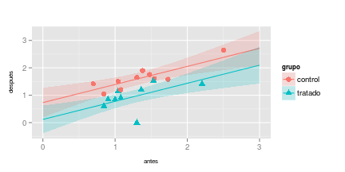

Se trata de analizar los datos de dos ensayos sencillos en los que se comparan dos
grupos, en el primer caso mediante una respuesta continua y en el segundo mediante una
respuesta dicotómica.

En ambos casos hay que comparar las respuestas de los dos grupos primero sin ajustes
de ningún tipo y luego ajustando por las covariables que se consideren oportunas. También
hay que seleccionar un tamaño muestral para un ensayo posterior algo mayor y redactar un
pequeño informe con las conclusiones (que contenga un anexo con el script de R que se haya
utilizado).

# **PRIMER ENSAYO**

Son datos de un ensayo clínico con pacientes con adenomas en colon y recto. (Giardielo
et al., 1993, Treatment of colonic and rectal adenomas with Sulindac in familial adenomatous
polyposis. New England Journal of Medicine, 328, 1313-1316).

Los datos muestran el número de pólipos, en logaritmos decimales, al principio del
ensayo y al año de tratamiento:


|grupo   |   antes| despues|
|:-------|-------:|-------:|
|tratado | 0.84510| 0.60206|
|control | 0.69897| 1.41497|
|tratado | 1.36173| 1.20412|
|control | 1.54407| 1.60206|
|tratado | 1.04139| 1.14613|
|control | 1.07918| 1.20412|
|control | 0.84510| 1.04139|
|control | 2.50243| 2.63749|
|tratado | 2.20412| 1.41497|
|tratado | 0.90309| 0.84510|
|control | 1.30103| 1.65321|
|control | 1.04139| 1.50515|
|control | 1.38021| 1.90309|
|tratado | 1.53148| 1.53148|
|control | 1.73239| 1.57978|
|control | 1.47712| 1.75587|
|tratado | 1.00000| 0.84510|
|tratado | 1.30103| 0.00000|
|tratado | 1.07918| 0.90309|

Sumario de los datos:

$\\$


|grupo        |variable     |value           |
|:------------|:------------|:---------------|
|control:20   |antes  :19   |Min.   :0.000   |
|tratado:18   |despues:19   |1st Qu.:1.010   |
|             |             |Median :1.301   |
|             |             |Mean   :1.307   |
|             |             |3rd Qu.:1.541   |
|             |             |Max.   :2.637   |


|grupo   |  Min.| 1st Qu.| Median|  Mean| 3rd Qu.|  Max.|
|:-------|-----:|-------:|------:|-----:|-------:|-----:|
|antes   | 0.699|   1.021|  1.301| 1.309|   1.504| 2.502|
|despues | 0.000|   0.972|  1.415| 1.305|   1.591| 2.637|


|grupo   |  Min.| 1st Qu.| Median|  Mean| 3rd Qu.|  Max.|
|:-------|-----:|-------:|------:|-----:|-------:|-----:|
|control | 0.699|   1.173|  1.491| 1.495|   1.673| 2.637|
|tratado | 0.000|   0.860|  1.060| 1.098|   1.347| 2.204|


|grupo   |variable |  n|  Min.| 1st Qu.| Median|  Mean| 3rd Qu.|  Max.|
|:-------|:--------|--:|-----:|-------:|------:|-----:|-------:|-----:|
|control |antes    | 10| 0.699|   1.051|  1.341| 1.360|   1.527| 2.502|
|control |despues  | 10| 1.041|   1.438|  1.591| 1.630|   1.730| 2.637|
|tratado |antes    |  9| 0.845|   1.000|  1.079| 1.252|   1.362| 2.204|
|tratado |despues  |  9| 0.000|   0.845|  0.903| 0.944|   1.204| 1.531|

\pagebreak

**Objetivos del análisis estadístico:**

## 1. Análisis estadístico de los datos. ¿Tiene algún efecto el tratamiento en los resultados?

### a) Primera aproximación: análisis de única variable respuesta `despues`

+ **Análisis descriptivo**


|grupo   |  n|  Min.| 1st Qu.| Median|  Mean| 3rd Qu.|  Max.|     S|    SE|
|:-------|--:|-----:|-------:|------:|-----:|-------:|-----:|-----:|-----:|
|control | 10| 1.041|   1.438|  1.591| 1.630|   1.730| 2.637| 0.434| 0.137|
|tratado |  9| 0.000|   0.845|  0.903| 0.944|   1.204| 1.531| 0.462| 0.154|

donde desviación típica $S=\frac{x-\bar{x}}{n-1}$ y error estándar de la media $SE_{\bar{x}}=\frac{s}{\sqrt{n}}$

$\\$

 

$\\$

El número de pólipos al año de tratamiento parece ser mayor en el grupo control que en el grupo tratado.

\pagebreak

+ **Análisis estadístico: ¿es la media en el número de pólipos al año de tratamiento significativamente diferente entre los grupos `control` y `tratado`?**

$H_0:\mu_c=\mu_t \ ; \ H_1:\mu_c\neq\mu_t$
$\\$

**ANOVA:** F-test $\rightarrow F=\frac{MS_B}{MSE}$
$\\$


|            | Df| Sum Sq| Mean Sq| F value| Pr(>F)|
|:-----------|--:|------:|-------:|-------:|------:|
|grupo       |  1|  2.230|    2.23|  11.138|  0.004|
|Residuals   | 17|  3.404|    0.20|      NA|     NA|

donde:

+ `Sum Sq` es la suma de cuadrados entre grupos $SSB$ (`grupo`)  
y la suma de cuadrados dentro de los grupos $SSE$ (`residuals`)
+ `Mean Sq` es la variabilidad entre grupos $MS_B$ (`grupo`)  
y la variabilidad dentro de los grupos $MSE$ (`residuals`)
+ `F value` es el $\text{F-ratio}$ (`grupo`)
+ `Pr(>F)` es el p-value (`grupo`)

$\text{F-ratio}>1$ es significativo $\rightarrow MS_B>MSE \rightarrow$ se rechaza $H_0$
$\\$

**Comparación de medias:** t-test $\rightarrow t=\frac{\bar{x_t}-\bar{x_c}}{SE_\text{diff}}$

donde $SE_\text{diff}=\sqrt{\frac{S^2_c}{n_c}+\frac{S^2_t}{n_t}}=\frac{S_c}{\sqrt{n_c}}+\frac{S_t}{\sqrt{n_t}}$ 
$\\$


|             | Estimate| Std. Error| t value| Pr(>&#124;t&#124;)|
|:------------|--------:|----------:|-------:|------------------:|
|(Intercept)  |    1.630|      0.141|  11.518|              0.000|
|grupotratado |   -0.686|      0.206|  -3.337|              0.004|


donde:

+ `Estimate` es la estimación de la media $\bar{x_c}$ (`Intercept`)  
y la estimación de la diferencia entre las medias $\bar{x_t}-\bar{x_c}$ (`grupotratado`)
+ `Std.Error` es el error estándar de la media $SE_{\bar{x_c}}$ (`Intercept`)  
y el error estándar de la diferencia entre las medias $SE_\text{diff}$ (`grupotratado`)
+ `|t-value|`$=t$ (`grupotratado`) 
+ `Pr(>|t|)` es el p-value (`grupotratado`)
$\\$

$Pr(>|t|)$ es significativo $\rightarrow \bar{x_c}-\bar{x_t}\neq0 \rightarrow$ se rechaza $H_0$

### b) Segunda aproximación: análisis de variable `efecto <- antes-despues`


|grupo   |   antes| despues|   efecto|
|:-------|-------:|-------:|--------:|
|tratado | 0.84510| 0.60206|  0.24304|
|control | 0.69897| 1.41497| -0.71600|
|tratado | 1.36173| 1.20412|  0.15761|
|control | 1.54407| 1.60206| -0.05799|
|tratado | 1.04139| 1.14613| -0.10474|
|control | 1.07918| 1.20412| -0.12494|
|control | 0.84510| 1.04139| -0.19629|
|control | 2.50243| 2.63749| -0.13506|
|tratado | 2.20412| 1.41497|  0.78915|
|tratado | 0.90309| 0.84510|  0.05799|
|control | 1.30103| 1.65321| -0.35218|
|control | 1.04139| 1.50515| -0.46376|
|control | 1.38021| 1.90309| -0.52288|
|tratado | 1.53148| 1.53148|  0.00000|
|control | 1.73239| 1.57978|  0.15261|
|control | 1.47712| 1.75587| -0.27875|
|tratado | 1.00000| 0.84510|  0.15490|
|tratado | 1.30103| 0.00000|  1.30103|
|tratado | 1.07918| 0.90309|  0.17609|

+ **Análisis descriptivo**


|grupo   |  n|   Min.| 1st Qu.| Median|   Mean| 3rd Qu.|  Max.|     S|   SE|
|:-------|--:|------:|-------:|------:|------:|-------:|-----:|-----:|----:|
|control | 10| -0.716|  -0.436| -0.238| -0.270|  -0.128| 0.153| 0.253| 0.08|
|tratado |  9| -0.105|   0.058|  0.158|  0.308|   0.243| 1.301| 0.449| 0.15|

 

Para mismos valores de `antes`, el grupo control tiene valores mayores de `despues` $\rightarrow$ parece haber diferencias en el efecto entre los dos grupos de tratamiento.

+ **Análisis estadístico: ¿es la media del `efecto` significativamente diferente entre los grupos `control` y `tratado`?**

$H_0:\mu_c=\mu_t \ ; \ H_1:\mu_c\neq\mu_t$
$\\$

**ANOVA:** F-test $\rightarrow F=\frac{MS_B}{MSE}$
$\\$


|            | Df| Sum Sq| Mean Sq| F value| Pr(>F)|
|:-----------|--:|------:|-------:|-------:|------:|
|grupo       |  1|  1.582|   1.582|  12.287|  0.003|
|Residuals   | 17|  2.188|   0.129|      NA|     NA|

$\text{F-ratio}>1$ es significativo $\rightarrow MS_B>MSE \rightarrow$ se rechaza $H_0$
$\\$

**Comparación de medias:** t-test $\rightarrow t=\frac{\bar{x_t}-\bar{x_c}}{SE_\text{diff}}$
$\\$


|             | Estimate| Std. Error| t value| Pr(>&#124;t&#124;)|
|:------------|--------:|----------:|-------:|------------------:|
|(Intercept)  |   -0.270|      0.113|  -2.375|              0.030|
|grupotratado |    0.578|      0.165|   3.505|              0.003|

$Pr(>|t|)$ es significativo $\rightarrow \bar{x_c}-\bar{x_t}\neq0 \rightarrow$ se rechaza $H_0$

\pagebreak

### c) Tercera aproximación: ANCOVA (covariable `antes`)

+ **Análisis descriptivo**  

$\text{despues}_c=\alpha_c+\beta_c * \text{antes}_c$

$\text{despues}_t=\alpha_t+\beta_t * \text{antes}_t$
$\\$


 

El intercept $\alpha$ es diferente para cada grupo $\rightarrow$ el grupo de tratamiento parece tener efecto sobre la variable respuesta `despues`, donde el grupo control presentaría mayor número de pólipos al año de tratamiento que el grupo tratado.

La pendiente $\beta$ es similar entre ambos grupos $\rightarrow$ el efecto de la covariable `antes` sobre la variable respuesta `despues` parece ser similar para ambos grupos, y no parece haber interacción entre la covariable y el grupo.

+ **Análisis estadístico**

**Ajuste de modelo completo con interacción:**
$\\$

$\text{despues}=\alpha_{grupo}+\beta * \text{antes}+\alpha_{grupo}\beta * \text{antes}$
$\\$


|                   | Estimate| Std. Error| t value| Pr(>&#124;t&#124;)|
|:------------------|--------:|----------:|-------:|------------------:|
|(Intercept)        |    0.628|      0.317|   1.985|              0.066|
|grupotratado       |   -0.351|      0.488|  -0.719|              0.483|
|antes              |    0.736|      0.219|   3.361|              0.004|
|grupotratado:antes |   -0.204|      0.358|  -0.570|              0.577|

donde:

+ `Intercept`: Intercept 1 $\alpha_{grupo=control}+\beta*(\text{antes=x})+\alpha_{grupo=control}\beta*(\text{antes=x})$

+ `grupotratado`: diferencia Intercept 2 $\alpha_{grupo=tratado}$ - Intercept 1

+ `antes`: pendiente 1 $\beta*(\text{antes=x+1})$

+ `grupotratado:antes`: diferencia pendiente 2 $\beta*[\text{(grupo=tratado):(antes=x+1)}]$ - pendiente 1

En presencia del término de interacción, los 'efectos principales' son efectos condicionales (hay tantos efectos `grupotratado` como niveles `antes`, y tantos efectos `antes` como niveles `grupotratado`).

El efecto debido al término de interacción `grupotratado:antes` no es significativo $\rightarrow$ debe eliminarse del modelo.
$\\$

Suma de cuadrados de tipo I (secuencial):


|            | Df| Sum Sq| Mean Sq| F value| Pr(>F)|
|:-----------|--:|------:|-------:|-------:|------:|
|grupo       |  1|  2.230|   2.230|  19.546|  0.000|
|antes       |  1|  1.655|   1.655|  14.507|  0.002|
|grupo:antes |  1|  0.037|   0.037|   0.325|  0.577|
|Residuals   | 15|  1.711|   0.114|      NA|     NA|

donde `grupo`: $SS(B)$, `antes`: $SS(A|B)$, `grupo:antes`: $SS(A*B|A,B)$
$\\$


|            | Df| Sum Sq| Mean Sq| F value| Pr(>F)|
|:-----------|--:|------:|-------:|-------:|------:|
|antes       |  1|  2.121|   2.121|  18.592|  0.001|
|grupo       |  1|  1.764|   1.764|  15.461|  0.001|
|antes:grupo |  1|  0.037|   0.037|   0.325|  0.577|
|Residuals   | 15|  1.711|   0.114|      NA|     NA|

donde: `antes`: $SS(A)$, `grupo`: $SS(B|A)$, `antes:grupo`: $SS(A*B|A,B)$
$\\$

La variabilidad debida a la interacción `grupo:antes` no es significativa $\rightarrow$ análisis de efectos principales.

\pagebreak

**Ajuste de modelo sin interacción:**
$\\$

$\text{despues}=\alpha_{grupo}+\beta * \text{antes}$
$\\$


|             | Estimate| Std. Error| t value| Pr(>&#124;t&#124;)|
|:------------|--------:|----------:|-------:|------------------:|
|(Intercept)  |    0.732|      0.253|   2.892|              0.011|
|grupotratado |   -0.615|      0.153|  -4.018|              0.001|
|antes        |    0.660|      0.170|   3.892|              0.001|

donde:

+ `Intercept`: Intercept 1 $\alpha_{grupo=control}+\beta*(\text{antes=x})$

+ `grupotratado`: diferencia Intercept 2 $\alpha_{grupo=tratado}$ - Intercept 1

+ `antes`: pendiente $\beta*(\text{antes=x+1})$

El factor `grupo` y la covariable `antes` son significativos.
$\\$

Suma de cuadrados de tipo II:


|          | Df| Sum Sq| Mean Sq| F value| Pr(>F)|
|:---------|--:|------:|-------:|-------:|------:|
|grupo     |  1|  2.230|   2.230|  20.407|  0.000|
|antes     |  1|  1.655|   1.655|  15.146|  0.001|
|Residuals | 16|  1.749|   0.109|      NA|     NA|

donde `antes`: $SS(B|A)$
$\\$


|          | Df| Sum Sq| Mean Sq| F value| Pr(>F)|
|:---------|--:|------:|-------:|-------:|------:|
|antes     |  1|  2.121|   2.121|  19.411|  0.000|
|grupo     |  1|  1.764|   1.764|  16.142|  0.001|
|Residuals | 16|  1.749|   0.109|      NA|     NA|

donde `grupo`: $SS(A|B)$
$\\$


|       | Df| Sum of Sq|      RSS|       AIC|  F value|    Pr(>F)|
|:------|--:|---------:|--------:|---------:|--------:|---------:|
|<none> | NA|        NA| 1.748519| -39.32773|       NA|        NA|
|grupo  |  1|  1.764084| 3.512602| -28.07355| 16.14243| 0.0009942|
|antes  |  1|  1.655198| 3.403717| -28.67185| 15.14606| 0.0012960|

donde `grupo`: $SS(A|B)$ y `antes`: $SS(B|A)$
$\\$

Ambos efectos principales `grupo` y `antes` son significativos en presencia del otro.
$\\$


El modelo mínimo adecuado es: $\text{despues}=\alpha_{grupo}+\beta * \text{antes}$
$\\$


|grupo   | antes| despues|   fit| IC_lwr| IC_upr|grupo   | antes| despues|   fit| IC_lwr| IC_upr|
|:-------|-----:|-------:|-----:|------:|------:|:-------|-----:|-------:|-----:|------:|------:|
|control | 0.699|   1.415| 1.193|  0.868|  1.518|tratado | 0.845|   0.602| 0.675|  0.400|  0.951|
|control | 0.845|   1.041| 1.290|  1.001|  1.579|tratado | 0.903|   0.845| 0.713|  0.448|  0.979|
|control | 1.041|   1.505| 1.419|  1.170|  1.669|tratado | 1.000|   0.845| 0.777|  0.527|  1.028|
|control | 1.079|   1.204| 1.444|  1.201|  1.688|tratado | 1.041|   1.146| 0.805|  0.559|  1.050|
|control | 1.301|   1.653| 1.591|  1.368|  1.813|tratado | 1.079|   0.903| 0.830|  0.588|  1.071|
|control | 1.380|   1.903| 1.643|  1.421|  1.865|tratado | 1.301|   0.000| 0.976|  0.742|  1.210|
|control | 1.477|   1.756| 1.707|  1.481|  1.932|tratado | 1.362|   1.204| 1.016|  0.779|  1.253|
|control | 1.544|   1.602| 1.751|  1.520|  1.982|tratado | 1.531|   1.531| 1.128|  0.874|  1.382|
|control | 1.732|   1.580| 1.875|  1.616|  2.134|tratado | 2.204|   1.415| 1.572|  1.157|  1.986|
|control | 2.502|   2.637| 2.383|  1.917|  2.850|NA      |    NA|      NA|    NA|     NA|     NA|

 


\pagebreak

## 2. Se va a realizar un ensayo algo más grande en el que se va a utilizar un nivel de significatividad $\alpha$ = 0.05. Se desea obtener una potencia del 95% para detectar diferencias de medias (en escala logarítmica) de 0.4 unidades. ¿Cuántos pacientes por grupo se necesitan? ¿Variaría mucho el tamaño muestral si en lugar de utilizar un estimador puntual de la varianza, común a ambos grupos, se utilizara el extremo superior del intervalo de confianza al 80% sobre esa varianza desconocida?

* Utilizando estimador puntual de varianza común

$\alpha=0.05$  
$\text{potencia}=0.95$  
$\text{detect.} \ \bar{x}_\text{t.despues}-\bar{x}_\text{c.despues}=0.4$  

$n_c=10$  
$n_t=9$  
$S^2_c=0.19$  
$S^2_t=0.21$  

$S_{x_cx_t} = \sqrt{\frac{(n_c-1)s_{x_c}^2+(n_t-1)s_{x_t}^2}{n_c+n_t-2}}=0.45$


```
     Two-sample t test power calculation 

              n = 33.51421
          delta = 0.4
             sd = 0.447458
      sig.level = 0.05
          power = 0.95
    alternative = two.sided

NOTE: n is number in *each* group
```
Tamaño muestral necesario para cada grupo $N = 34$.
$\\$

* Utilizando extremo superior del intervalo de confianza al 80% sobre varianza desconocida

*preguntar*

\pagebreak

## Informe final

blablabla

\pagebreak

## ANEXO I

### Datos


```r
grupo <- as.factor(c(1,0,1,0,1,0,0,0,1,1,0,0,0,1,0,0,1,1,1))
levels(grupo) <- c('control','tratado')
dat.polipos <- data.frame(grupo= grupo,
                          antes = c(0.84510,0.69897,1.36173,1.54407,1.04139,1.07918, 0.84510,
                                    2.50243,2.20412,0.90309,1.30103,1.04139,1.38021,1.53148,
                                    1.73239,1.47712,1.00000, 1.30103,1.07918),
                          despues=c(0.60206,1.41497,1.20412,1.60206,1.14613,1.20412,1.04139,
                                    2.63749,1.41497,0.84510,1.65321,1.50515,1.90309,1.53148,
                                    1.57978,1.75587,0.84510,0.00000,0.90309))
```


```r
# tabla datos
kable(dat.polipos, caption = "Datos del ensayo")
```


```r
# datos long-format
dat.pol_lf<-melt(data = dat.polipos,measure.vars = c("antes","despues"))

# sumario
sum1<-summary(dat.pol_lf)
    # para sustituir NAs por "" en grupo y variable en `kable`:
sum1<-data.frame(grupo=c(sum1[1:2,1],rep("",4)),
                 variable=c(sum1[1:2,2],rep("",4)),
                 value=sum1[,3]) 
kable(sum1,caption = "Sumario")

# sumario antes/después
sum_names<-c("grupo","Min.","1st Qu.","Median","Mean","3rd Qu.","Max.")
kable(summaryBy(formula = value~variable,data = dat.pol_lf,FUN = summary),
      caption = "Sumario antes/después",
      col.names = sum_names,
      digits = 3)

# sumario grupo
kable(summaryBy(formula = value~grupo,data = dat.pol_lf,FUN = summary),
      caption = "Sumario por grupo de tratamiento",
      col.names = sum_names,
      digits = 3)

# sumario grupo antes/después
sum2<-summaryBy(formula = value~grupo*variable,data = dat.pol_lf,FUN = summary)
    # summaryBy no tiene `n`:
n<-summaryBy(formula = value~grupo*variable,data = dat.pol_lf,FUN = length)
sum2_n<-data.frame(sum2[,1:2],n$value.length,sum2[,3:8])
sum_names_n<-c("grupo","variable","n","Min.","1st Qu.","Median","Mean","3rd Qu.","Max.")
kable(sum2_n,
      caption = "Sumario por grupo de tratamiento antes/después",
      col.names = sum_names_n,
      digits = 3)
```

### a) Primera aproximación

* Análisis descriptivo


```r
# sumario
sum_d<-summaryBy(formula = despues~grupo,data = dat.polipos,FUN = summary)
    # + n:
n_d<-summaryBy(formula = despues~grupo,data = dat.polipos,FUN = length)[,2]
    # + s y se
sd_despues<-summaryBy(formula = despues~grupo,data = dat.polipos,FUN = sd)[,2]
se_despues<-sd_despues/sqrt(n_d)
# tabla
sum_d_ns<-data.frame(sum_d[,1],n_d,sum_d[,2:7],sd_despues,se_despues)
sum_d_names<-c("grupo","n","Min.","1st Qu.","Median","Mean","3rd Qu.","Max.","S","SE")
kable(sum_d_ns,col.names = sum_d_names,
      caption = "Sumario por grupo de tratamiento antes/después",
      digits = 3)
```


```r
# boxplot
ggplot(data = dat.polipos, aes(x = grupo, y=despues, fill=grupo))+
    geom_boxplot()+
    stat_summary(fun.y="mean", geom="point", shape=4, size=3)+
    labs(x="",y="",title="Número de pólipos al año de tratamiento\n")+
    theme(plot.title=element_text(size=10))+
    scale_fill_discrete(guide=F)
```

* Análisis estadístico


```r
# test heterocedasticidad
bartlett.test(formula = despues~grupo,data = dat.polipos)
```

```
## 
## 	Bartlett test of homogeneity of variances
## 
## data:  despues by grupo
## Bartlett's K-squared = 0.0294, df = 1, p-value = 0.8638
```

```r
# --> hay homogeneidad de varianzas entre los grupos control y tratamiento
```


```r
# ANOVA
despues.aov<-summary(aov(formula = despues~grupo,data = dat.polipos))
kable(despues.aov[[1]],caption = "ANOVA control-tratamiento",digits = 3)
```


```r
# t-test
despues.lm<-summary(lm(formula = despues~grupo,data = dat.polipos))
kable(despues.lm$coefficients,
      caption = "t-test control-tratamiento",
      digits = 3)
```

\pagebreak

### b) Segunda aproximación


```r
# datos efecto
dat.polipos_effect<-data.frame(dat.polipos,efecto=dat.polipos$antes-dat.polipos$despues)
kable(dat.polipos_effect,caption = "Datos del ensayo 2")
```

* Análisis descriptivo


```r
# sumario
sum_e<-summaryBy(formula = efecto~grupo,data = dat.polipos_effect,FUN = summary)
    # + n
n_e<-summaryBy(formula = efecto~grupo,data = dat.polipos_effect,FUN = length)[,2]
    # + sd y se
sd_e<-summaryBy(formula = efecto~grupo,data = dat.polipos_effect,FUN = sd)[,2]
se_e<-sd_e/sqrt(n_e)

# tabla
sum_e_ns<-data.frame(sum_e[,1],n_e,sum_e[,2:7],sd_e,se_e)
sum_e_names<-c("grupo","n","Min.","1st Qu.","Median","Mean","3rd Qu.","Max.","S","SE")
kable(sum_e_ns,col.names = sum_e_names,
      caption = "Sumario del efecto por grupo de tratamiento",
      digits = 3)
```


```r
# plot
ggplot(data = dat.polipos,aes(x = antes,y = despues,colour = grupo,shape = grupo))+
    geom_point(size=3)+
    labs(title="Número de pólipos antes / después de tratamiento\n",
         x="\nantes",y="después\n")+
    theme(plot.title=element_text(size=10),
          axis.title=element_text(size=8),
          legend.title=element_text(size=8))
```

* Análisis estadístico


```r
# test heterocedasticidad
bartlett.test(formula = efecto~grupo,data = dat.polipos_effect)
```

```
## 
## 	Bartlett test of homogeneity of variances
## 
## data:  efecto by grupo
## Bartlett's K-squared = 2.5576, df = 1, p-value = 0.1098
```

```r
# --> hay homogeneidad de varianzas entre los grupos control y tratamiento
```


```r
# ANOVA
efecto.aov<-summary(aov(formula = efecto~grupo,data = dat.polipos_effect))
kable(efecto.aov[[1]],caption = "ANOVA control-tratamiento",digits = 3)
```


```r
# t-test
efecto.lm<-summary(lm(formula = efecto~grupo,data = dat.polipos_effect))
kable(efecto.lm$coefficients,
      caption = "t-test control-tratamiento",
      digits = 3)
```

### c) Tercera aproximación

* Análisis descriptivo


```r
# ajuste grupo control
cont.lm<-with(dat.polipos,lm(despues[grupo=="control"]~antes[grupo=="control"]))
cont.coefs<-cont.lm$coefficients

# ajuste grupo tratado
trat.lm<-with(dat.polipos,lm(despues[grupo=="tratado"]~antes[grupo=="tratado"]))
trat.coefs<-trat.lm$coefficients

grupo.coefs<-data.frame(grupo=c("control","tratado"),
                        Intercept=c(cont.coefs[1],trat.coefs[1]),
                        slope=c(cont.coefs[2],trat.coefs[2]))
```


```r
# plot
ggplot(data = dat.polipos,aes(x = antes,y = despues,colour = grupo,shape = grupo))+
    geom_point(size=3)+
    labs(title="Rectas de regresión grupo control y grupo tratado\n",
         x="\nantes",y="después\n")+
    theme(plot.title=element_text(size=10),
          axis.title=element_text(size=8),
          legend.title=element_text(size=8))+
    geom_abline(data=grupo.coefs,aes(intercept=Intercept,slope=slope,colour=grupo))
```

* Análisis estadístico


```r
# ajuste
pol.lm_max<-with(dat.polipos,lm(despues~grupo*antes))
ancova<-summary(pol.lm_max)
# summary
kable(ancova$coefficients,
      caption = "ANCOVA interacción",
      digits = 3)
```


```r
# SSI (A,B,AB)
kable(anova(pol.lm_max),
      caption = "Tabla ANOVA interacción (A,B,AB)",
      digits = 3)
```


```r
# SSI (B,A,AB)
pol.lm_max2<-with(dat.polipos,lm(despues~antes*grupo))
kable(anova(pol.lm_max2),
      caption = "Tabla ANOVA interacción (B,A,AB)",
      digits = 3)
```


```r
# SSII (A,B)
kable(anova(pol.lm_main),
      caption = "Tabla ANOVA efectos principales (A,B)",
      digits = 3)
```


```r
# SSII (B,A)
pol.lm_main2<-with(dat.polipos,lm(despues~antes+grupo))
kable(anova(pol.lm_main2),
      caption = "Tabla ANOVA efectos principales (B,A)",
      digits = 3)
```


```r
# SSII
kable(drop1(pol.lm_main, ~ ., test="F"),caption = "SSII efectos principales")
```


```r
# modelo mínimo adecuado
step(pol.lm_max)
```

```
## Start:  AIC=-37.73
## despues ~ grupo * antes
## 
##               Df Sum of Sq    RSS     AIC
## - grupo:antes  1   0.03708 1.7485 -39.328
## <none>                     1.7114 -37.735
## 
## Step:  AIC=-39.33
## despues ~ grupo + antes
## 
##         Df Sum of Sq    RSS     AIC
## <none>               1.7485 -39.328
## - antes  1    1.6552 3.4037 -28.672
## - grupo  1    1.7641 3.5126 -28.074
```

```
## 
## Call:
## lm(formula = despues ~ grupo + antes)
## 
## Coefficients:
##  (Intercept)  grupotratado         antes  
##       0.7322       -0.6147        0.6598
```


```r
# fitted data con IC
IC.fit<-predict(pol.lm_main,interval = "confidence") # level = 0.95 por defecto
dat.pol.fit<-data.frame(dat.polipos,fit=pol.lm_main$fitted.values,
                        IC_lwr=IC.fit[,2],IC_upr=IC.fit[,3])

# IC tabla
dat.pol.cont.IC<-dat.pol.fit[dat.pol.fit$grupo=="control",]
dat.pol.cont.IC2<-dat.pol.cont.IC[order(dat.pol.cont.IC$fit),]
dat.pol.trat.IC<-rbind(dat.pol.fit[dat.pol.fit$grupo=="tratado",],rep(NA,6))
dat.pol.trat.IC2<-dat.pol.trat.IC[order(dat.pol.trat.IC$fit,na.last = T),]
dat.pol.IC<-cbind(dat.pol.cont.IC2,dat.pol.trat.IC2)
row.names(dat.pol.IC)<-NULL
kable(dat.pol.IC,caption="Ajuste modelo final - IC 95%",digits=3)
```


```r
# plot
ggplot(data = dat.pol.fit,aes(x = antes,y = despues,colour = grupo,shape = grupo))+
    geom_point(size=3)+
    labs(title="",x="\nantes",y="después\n")+
    theme(axis.title=element_text(size=8),
          legend.title=element_text(size=8))+
    geom_line(aes(x=antes,y=fit))+
    geom_ribbon(aes(y=fit,ymin=IC_lwr,ymax=IC_upr,fill=grupo),alpha=0.2,linetype="dashed")
```

### Tamaño muestral

* Estimador varianza


```r
# estimador desviación típica común
nc<-10
nt<-9
var_c<-with(dat.polipos,var(despues[grupo=="control"])); var_c
var_t<-with(dat.polipos,var(despues[grupo=="tratado"])); var_t
sigm<-sqrt(((nc-1)*var_c+(nt-1)*var_t)/(nc+nt-2)); sigm
```


```r
# tamaño muestral
power.t.test(delta = 0.4,sd = sigm,sig.level = 0.05,power = 0.95) 
# (alternative="two.sided" por defecto)
```

* IC

\pagebreak

# SEGUNDO ENSAYO

Vamos a utilizar los datos `linfoma.dat` ya estudiados en la tarea sobre supervivencia. Ahora vamos a suponer que el objetivo principal del ensayo era la supervivencia a un horizonte de 1, no las curvas de supervivencia.

La variable respuesta, por tanto, será si el tiempo `B3TODEATH` es mayor o menor que 1. Además, al comparar la probabilidad de ‘tiempo de supervivencia mayor que uno’ en los dos grupos, queremos calcular los odds ratio a favor del grupo sin radiación, por lo que este grupo debe tener un código mayor que el otro grupo.

Para conseguir la nueva variable respuesta y la nueva codificación de grupos, vamos a sustituir las variables originales `B3TODEATH` y `GROUP` por las nuevas variables `efectivo` y `grupo`.
$\\$


|   |efectivo |grupo  |sexo   |edad | kps|
|:--|:--------|:------|:------|:----|---:|
|1  |FALSE    |Si.Rad |Hombre |>60  |  75|
|2  |TRUE     |Si.Rad |Mujer  |<60  |  50|
|3  |TRUE     |Si.Rad |Hombre |>60  |  90|
|4  |TRUE     |Si.Rad |Hombre |>60  | 100|
|5  |TRUE     |Si.Rad |Hombre |>60  |  95|
|6  |FALSE    |Si.Rad |Hombre |>60  |  80|


|   |efectivo |grupo  |sexo   |edad | kps|
|:--|:--------|:------|:------|:----|---:|
|53 |TRUE     |No.Rad |Hombre |>60  | 100|
|54 |TRUE     |No.Rad |Hombre |<60  |  80|
|55 |TRUE     |No.Rad |Mujer  |<60  | 100|
|56 |TRUE     |No.Rad |Hombre |>60  | 100|
|57 |FALSE    |No.Rad |Hombre |<60  |  60|
|58 |TRUE     |No.Rad |Hombre |>60  | 100|


|efectivo   |grupo       |sexo        |edad     |kps              |
|:----------|:-----------|:-----------|:--------|:----------------|
|FALSE:21   |Si.Rad:19   |Hombre:38   |<60:21   |Min.   : 40.00   |
|TRUE :37   |No.Rad:39   |Mujer :20   |>60:37   |1st Qu.: 70.00   |
|           |            |            |         |Median : 80.00   |
|           |            |            |         |Mean   : 80.78   |
|           |            |            |         |3rd Qu.: 95.00   |
|           |            |            |         |Max.   :100.00   |

**Objetivos del análisis estadístico:**

## 1. Análisis estadístico de los datos. ¿Tiene algún efecto el tratamiento en los resultados? ¿Influyen las covariables?

* Análisis descriptivo


 

$\\$


|grupo  |efectivo |  n|  odds|
|:------|:--------|--:|-----:|
|Si.Rad |FALSE    | 10| 1.111|
|Si.Rad |TRUE     |  9| 0.900|
|No.Rad |FALSE    | 11| 0.393|
|No.Rad |TRUE     | 28| 2.545|

El tratamiento sin radiación parece ser más efectivo que el tratamiento con radiación.

\pagebreak

* Análisis estadístico

**Comparación de frecuencias observadas-esperadas: Ji-cuadrado**
$\\$

$H_0: \text{las variables 'grupo' y 'efectivo' son independientes}$

$H_1: \text{las variables 'grupo' y 'efectivo' no son independientes}$
$\\$


|       | FALSE| TRUE|
|:------|-----:|----:|
|Si.Rad |    10|    9|
|No.Rad |    11|   28|


$\chi^2 = \sum_{i=1}^{n} \frac{(O_i - E_i)^2}{E_i}$

$\\$
donde:

$O_i$: frecuencia observada

$E_i$: frecuencia esperada (si $H_0$ es cierta) 
$\frac{\text{nº casos nivel 'grupo' * nº casos nivel 'efectivo'}}{\text{total casos}}$

$n$: número de celdas
$\\$


|       |  FALSE|   TRUE|
|:------|------:|------:|
|Si.Rad |  6.879| 12.121|
|No.Rad | 14.121| 24.879|


|          | statistic| df| p.value|
|:---------|---------:|--:|-------:|
|X-squared |       3.3|  1|   0.069|

$p-valor > \alpha=0.05 \rightarrow$ no se rechazaría $H_0$

\pagebreak

**Comparación de dos proporciones: ARD, RR, OR, NNT**
$\\$


|       | FALSE| TRUE|   |
|:------|-----:|----:|--:|
|Si.Rad |    10|    9| 19|
|No.Rad |    11|   28| 39|
|       |    21|   37| 58|


|       |FALSE |TRUE |        |
|:------|:-----|:----|:-------|
|Si.Rad |a     |b    |a+b     |
|No.Rad |c     |d    |c+d     |
|       |a+c   |b+d  |a+b+c+d |

Siendo el riesgo la no efectividad, *T* radiación, y *C* no radiación:

+ $AR$: riesgo absoluto (proporciones) $\pi_T=\frac{a}{a+b}, \ \pi_C=\frac{c}{c+d}$

+ $ARD$: diferencia de riesgos $\pi_C-\pi_C$

+ $RR$: cociente de riesgos $\frac{\pi_T}{\pi_C}$

+ $O$: odds $\frac{\pi_\text{no ef.}}{\pi_\text{ef.}} \rightarrow O_T = \frac{a}{b}, \ O_C = \frac{c}{d}$

+ $OR$: odds ratio $\frac{O_T}{O_C}$

+ $NNT$: número que se necesita tratar $\frac{1}{\text{ARD}}$
$\\$


|    | estimación| IC.95.inf| IC.95.sup| IC.80.inf| IC.80.sup|
|:---|----------:|---------:|---------:|---------:|---------:|
|ARD |      0.244|    -0.017|     0.476|     0.070|     0.405|
|RR  |      1.866|     0.967|     3.602|     1.214|     2.869|
|OR  |      2.828|     0.905|     8.835|     1.343|     5.956|
|NNT |      4.094|        NA|        NA|     2.466|    14.289|

\pagebreak

**Regresión logística**

\pagebreak

## 2. Se va a realizar un ensayo algo más grande en el que se va a utilizar un nivel de significatividad $\alpha$ = 0.05. Se desea obtener una potencia del 80% para detectar probabilidades pA = 0.5 y pB = 0.7. ¿Cuántos pacientes por grupo se necesitan? ¿Variaría mucho ese tamaño si se quisiera una potencia del 90% o del 95%? ¿Y si pB = 0.6?

\pagebreak


```r
sessionInfo()
```

```
## R version 3.1.2 (2014-10-31)
## Platform: x86_64-pc-linux-gnu (64-bit)
## 
## locale:
##  [1] LC_CTYPE=en_GB.UTF-8       LC_NUMERIC=C              
##  [3] LC_TIME=en_GB.UTF-8        LC_COLLATE=en_GB.UTF-8    
##  [5] LC_MONETARY=en_GB.UTF-8    LC_MESSAGES=en_GB.UTF-8   
##  [7] LC_PAPER=en_GB.UTF-8       LC_NAME=C                 
##  [9] LC_ADDRESS=C               LC_TELEPHONE=C            
## [11] LC_MEASUREMENT=en_GB.UTF-8 LC_IDENTIFICATION=C       
## 
## attached base packages:
## [1] grid      splines   stats     graphics  grDevices utils     datasets 
## [8] methods   base     
## 
## other attached packages:
## [1] reshape2_1.4    vcd_1.3-2       gridExtra_0.9.1 doBy_4.5-11    
## [5] MASS_7.3-35     survival_2.37-7 knitr_1.7       ggplot2_1.0.0  
## 
## loaded via a namespace (and not attached):
##  [1] colorspace_1.2-4 digest_0.6.3     evaluate_0.5.5   formatR_1.0     
##  [5] gtable_0.1.2     htmltools_0.2.6  labeling_0.3     lattice_0.20-29 
##  [9] Matrix_1.1-4     munsell_0.4.2    plyr_1.8.1       proto_0.3-10    
## [13] Rcpp_0.11.3      rmarkdown_0.3.12 scales_0.2.4     stringr_0.6.2   
## [17] tools_3.1.2      yaml_2.1.13
```
